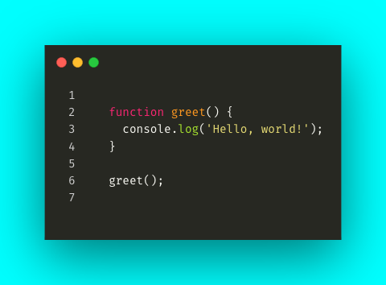

# CodeSnap

<!-- markdownlint-disable MD029 -->
<!-- markdownlint-disable MD033 -->
<div align="center">

[](https://github.com/francosion042/codesnap/actions/workflows/npm-publish.yml) [](https://www.npmjs.org/package/codesnap) [](https://opensource.org/licenses/MIT) [](http://makeapullrequest.com) [](https://www.npmjs.com/package/codesnap)

</div>

CodeSnap is a node.js library designed to programmatically generate images of code snippets. It provides a simple and convenient way to create beautiful snapshots of your code for further automated or programmatic usage.

## Installation

To install CodeSnap, you can use npm or yarn:

```bash
npm install codesnap
```

or

```bash
yarn add codesnap
```

## Usage

```javascript
import CodeSnap from "codesnap";

const config = {
  theme: "Monokai",
  backgroundColor: "Cyan",
  numberLines: true,
};

const codeSnap = new CodeSnap(config);

const code = `
function greet() {
  console.log('Hello, world!');
}

greet();
`;

codeSnap.snap(code);
```
<div align="center">
    
</div>

## Configuration

The `CodeSnap` constructor accepts a configuration object with the following properties:

- `theme`: The color theme to use for the code snippet.
- `backgroundColor`: The background color of the code snippet.
- `numberLines`: (Optional) A boolean value indicating whether to display line numbers.

## License

This project is licensed under the MIT License - see the [LICENSE](LICENSE) file for details.

## Credits

CodeSnap is powered by [Carbon.now.sh](https://carbon.now.sh/) and [Puppeteer](https://github.com/puppeteer/puppeteer).

